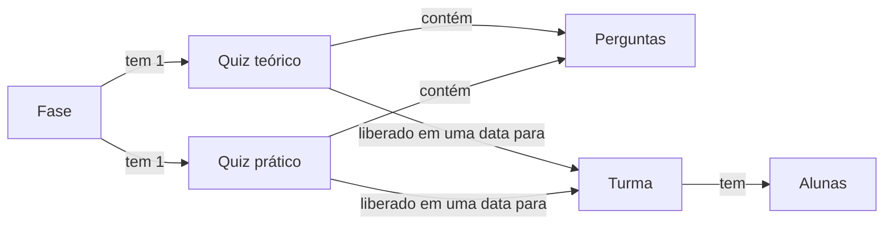
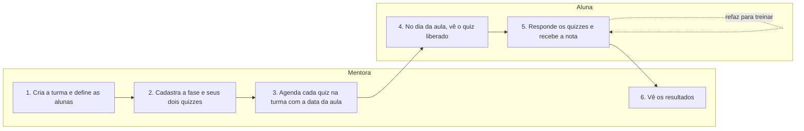

# BCC401 Programação Web - Trabalho Prático

# Integrantes

Bárbara Rodrigues Mateus

Jéssica C. Machado de Souza 

Taylanne Patricia Mendes

Gabriel Carlos Silva

Vinícius Nunes dos Anjos

# Nome: QuiX
Aplicativo web gamificado para que as alunas da ONG Código X testem seus conhecimentos sobre o conteúdo lecionado durante a Jornada.

## Motivação

Hoje as atividades de perguntas e respostas são feitas em uma plataforma externa que traz algumas dificuldades:

- **Plataforma não intuitiva:** a navegação é confusa para a organização dos quizzes.
- **Pouca personalização:** não dá para adaptar o formato dos quizzes, por exemplo com perguntas sobre blocos de código, nem o visual à identidade do Código X.
- **Custo:** funcionalidades básicas, como a lista de alunas cadastradas em cada turma, só estão disponíveis na versão paga.

O QuiX é uma alternativa própria, gratuita, simples de usar e adaptada às necessidades da ONG.

## Funcionalidades

- Quizzes organizados por módulo ou aula da Jornada
- Pontuação e acompanhamento de progresso das alunas
- Cadastro e gerenciamento de turmas e alunas
- Criação e edição de perguntas pelas mentoras
- Visualização do desempenho por aluna e por turma

# Tecnologias que serão utilizadas
Frot-end: HTML5, CSS3 e Tailwind CSS

Back-end: Python com Django

Banco de Dados: SQLite

Versionamento: Git e GitHub

Organização: Github Projects utilizando Kanban

# Kanban do Projeto
https://github.com/users/taylanne/projects/2

# Como rodar

### 1. Clonar o repositório

```bash
git clone <url-do-repositorio>
cd quix
```

### 2. Criar o ambiente virtual

```bash
python -m venv venv
```

### 3. Ativar o ambiente virtual

Windows (PowerShell):

```powershell
.\venv\Scripts\Activate.ps1
```

Linux/macOS:

```bash
source venv/bin/activate
```

### 4. Instalar as dependências

```bash
pip install django
```

### 5. Aplicar as migrações

```bash
python manage.py migrate
```

### 6. Rodar o servidor

```bash
python manage.py runserver
```

Acesse em http://127.0.0.1:8000/

## Fases da Trilha

O conteúdo da Trilha é dividido em **fases**, definidas antes do início das turmas. Cada fase tem uma parte teórica e uma prática, e por isso tem **dois quizzes**:

- **Quiz teórico:** perguntas sobre os conceitos da fase.
- **Quiz prático:** perguntas sobre a atividade feita no App Inventor ou no Blockly, com imagem dos blocos ou da tela no enunciado. Exemplos: "o que acontece quando este bloco é executado?" e "qual bloco completa o programa?".

Exemplos de fases:

| Fase | Nome | Quiz teórico | Quiz prático |
| --- | --- | --- | --- |
| 3 | Interface de usuário | O que é interface de usuário | Colocar imagem e legenda em uma tela no App Inventor |
| 4 | Por trás das telas | O que é um algoritmo | Exercícios no Blockly |
| 5 | Reino das condições | Condições com `se` / `senão` | Montar os blocos que trocam de tela no App Inventor |

## Como o conteúdo é organizado



- **Fase:** uma etapa da Trilha, com número, nome e descrição. Sempre tem exatamente um quiz teórico e um quiz prático.
- **Quiz:** conjunto de perguntas de múltipla escolha. As perguntas podem ter imagem.
- **Turma:** grupo de alunas. A mentora define uma vez quais alunas fazem parte de cada turma.
- **Liberação:** liga um quiz a uma turma com a data da aula. A partir dessa data, todas as alunas da turma veem aquele quiz. Os dois quizzes de uma mesma fase podem ser liberados em dias diferentes, por exemplo o teórico na aula de conceitos e o prático na aula seguinte.

Assim, a mentora não precisa atribuir alunas quiz por quiz: basta a aluna estar na turma e o quiz estar liberado para essa turma.

## Autenticação

As alunas e as mentoras já têm conta Google com o domínio da ONG, então o login é feito com **"Entrar com Google"**, sem senha própria do QuiX:

1. A usuária clica em "Entrar com Google" e escolhe a conta da ONG.
2. O backend valida o token do Google e confere se o e-mail é do domínio da ONG.
3. O backend procura esse e-mail entre as usuárias cadastradas e descobre o perfil (aluna ou mentora) e, no caso da aluna, a turma.
4. Contas de fora do domínio, ou que não foram cadastradas, não entram.

## Perfis de usuária

| Perfil | Quem é | O que faz no sistema |
| --- | --- | --- |
| Aluna | Participante de uma turma da Jornada | Responde os quizzes liberados para sua turma e acompanha pontuação e histórico |
| Mentora (admin) | Professora ou voluntária da ONG | Cadastra as fases e seus quizzes, monta as turmas, agenda a liberação dos quizzes e acompanha os resultados |

## Fluxo principal



## Funcionalidades do MVP

| ID | História de usuária | Perfil |
| --- | --- | --- |
| HU01 | Como usuária, quero entrar com a minha conta Google da ONG para acessar minha área | Aluna / Mentora |
| HU02 | Como mentora, quero criar turmas e definir quais alunas fazem parte de cada uma | Mentora |
| HU03 | Como mentora, quero cadastrar alunas pelo e-mail institucional da ONG | Mentora |
| HU04 | Como mentora, quero cadastrar as fases da Jornada com número, nome e descrição | Mentora |
| HU05 | Como mentora, quero montar o quiz teórico e o quiz prático de cada fase | Mentora |
| HU06 | Como mentora, quero criar perguntas de múltipla escolha, com imagem opcional dos blocos ou da tela | Mentora |
| HU07 | Como mentora, quero liberar cada quiz para uma turma em uma data, de forma independente | Mentora |
| HU08 | Como aluna, quero ver os quizzes já liberados para minha turma, organizados por fase | Aluna |
| HU09 | Como aluna, quero responder um quiz e ver na hora meus acertos e erros | Aluna |
| HU10 | Como aluna, quero refazer um quiz já respondido para fixar o conteúdo | Aluna |
| HU11 | Como aluna, quero acompanhar minha pontuação e os quizzes já respondidos | Aluna |
| HU12 | Como mentora, quero ver os resultados (nota da primeira tentativa) por turma, fase, quiz e aluna | Mentora |

### Regras de negócio

- Cada fase tem exatamente dois quizzes: um teórico e um prático. Os dois são criados junto com a fase.
- Cada aluna pertence a uma turma, definida pela mentora.
- A liberação é feita por quiz: cada quiz tem sua própria data em cada turma, mesmo que seja da mesma fase.
- Um quiz pode ser liberado para várias turmas, cada uma com sua data.
- Antes da data de liberação, o quiz não aparece para as alunas da turma. A fase aparece para a aluna quando pelo menos um dos seus quizzes já foi liberado.
- A aluna vê todos os quizzes liberados para a sua turma, sem atribuição individual.
- Só entra na plataforma quem tem conta Google do domínio da ONG e está cadastrada no QuiX.
- A correção é automática.
- A aluna pode refazer um quiz quantas vezes quiser, para fixar o conteúdo.
- A nota oficial, que vale para a pontuação e aparece nos resultados da mentora, é sempre a da **primeira tentativa**. As tentativas seguintes servem só para treino.
- Só mentoras acessam a área administrativa.

## Páginas

| Área | Página | O que mostra |
| --- | --- | --- |
| Pública | Login | Botão "Entrar com Google", aceitando só contas da ONG |
| Aluna | Início | Fases liberadas, pontuação total e progresso na Jornada |
| Aluna | Fase | Quizzes já liberados da fase, indicando os já respondidos |
| Aluna | Responder quiz | Perguntas uma a uma, com barra de progresso |
| Aluna | Resultado | Acertos e erros da tentativa, nota oficial e botão para refazer |
| Aluna | Histórico | Quizzes já respondidos, nota oficial e número de tentativas |
| Aluna | Perfil | Dados da aluna e turma |
| Mentora | Painel | Resumo: turmas, próximas liberações e desempenho médio |
| Mentora | Turmas | Lista de turmas, criação e edição |
| Mentora | Detalhe da turma | Alunas da turma e cronograma de liberação dos quizzes, organizado por fase |
| Mentora | Alunas | Cadastro (nome e e-mail da ONG), edição e busca de alunas |
| Mentora | Fases | Lista das fases da Jornada, em ordem |
| Mentora | Detalhe da fase | Dados da fase, acesso aos dois quizzes e datas de liberação de cada quiz por turma |
| Mentora | Editor de quiz | Perguntas, alternativas e imagens do quiz teórico ou prático |
| Mentora | Resultados | Desempenho por turma, fase, quiz e aluna |

## Rotas

As rotas da mentora ficam sob `/admin`, o que permite proteger toda a área administrativa com uma única verificação de perfil.

### Frontend

| Rota | Página | Acesso |
| --- | --- | --- |
| `/login` | Login | Público |
| `/` | Início | Aluna |
| `/fases/:id` | Fase | Aluna |
| `/quiz/:id` | Responder quiz | Aluna |
| `/quiz/:id/resultado` | Resultado | Aluna |
| `/historico` | Histórico | Aluna |
| `/perfil` | Perfil | Aluna / Mentora |
| `/admin` | Painel | Mentora |
| `/admin/turmas` | Turmas | Mentora |
| `/admin/turmas/:id` | Detalhe da turma | Mentora |
| `/admin/alunas` | Alunas | Mentora |
| `/admin/fases` | Fases | Mentora |
| `/admin/fases/nova` | Cadastro de fase | Mentora |
| `/admin/fases/:id` | Detalhe da fase | Mentora |
| `/admin/quizzes/:id/editar` | Editor de quiz | Mentora |
| `/admin/resultados` | Resultados | Mentora |

### API

| Método | Rota | Descrição |
| --- | --- | --- |
| POST | `/api/auth/google` | Entrar com Google: valida o token, confere o domínio da ONG e se a usuária está cadastrada |
| POST | `/api/auth/logout` | Encerrar sessão |
| GET | `/api/me` | Dados da usuária logada |
| GET | `/api/turmas` | Listar turmas |
| POST | `/api/turmas` | Criar turma |
| GET | `/api/turmas/:id` | Detalhar turma |
| PUT | `/api/turmas/:id` | Editar turma |
| DELETE | `/api/turmas/:id` | Remover turma |
| GET | `/api/turmas/:id/alunas` | Listar alunas da turma |
| POST | `/api/turmas/:id/alunas` | Adicionar alunas à turma |
| DELETE | `/api/turmas/:id/alunas/:alunaId` | Remover aluna da turma |
| GET | `/api/turmas/:id/liberacoes` | Cronograma de liberação dos quizzes na turma |
| POST | `/api/turmas/:id/liberacoes` | Liberar um quiz para a turma em uma data |
| PUT | `/api/turmas/:id/liberacoes/:quizId` | Alterar a data de liberação do quiz |
| DELETE | `/api/turmas/:id/liberacoes/:quizId` | Retirar o quiz da turma |
| GET | `/api/alunas` | Listar alunas |
| POST | `/api/alunas` | Cadastrar aluna |
| PUT | `/api/alunas/:id` | Editar aluna |
| DELETE | `/api/alunas/:id` | Remover aluna |
| GET | `/api/fases` | Listar fases (a aluna recebe só as fases com algum quiz liberado, e só os quizzes liberados) |
| POST | `/api/fases` | Criar fase (cria também o quiz teórico e o prático, vazios) |
| GET | `/api/fases/:id` | Detalhar fase com seus dois quizzes |
| PUT | `/api/fases/:id` | Editar fase |
| DELETE | `/api/fases/:id` | Remover fase e seus quizzes |
| GET | `/api/quizzes/:id` | Detalhar quiz com perguntas |
| PUT | `/api/quizzes/:id` | Editar perguntas e alternativas do quiz |
| POST | `/api/quizzes/:id/tentativas` | Enviar as respostas de uma tentativa (a primeira fica marcada como oficial) |
| GET | `/api/quizzes/:id/tentativas` | Listar as tentativas da aluna logada no quiz |
| POST | `/api/imagens` | Enviar imagem de blocos ou de tela para uma pergunta |
| GET | `/api/resultados` | Resultados oficiais (primeira tentativa), com filtros por turma, fase, quiz e aluna |

## Próximas versões

Ficam para depois do MVP:

- Perguntas interativas com blocos, em que a aluna monta ou ordena os blocos na tela
- Ranking da turma e conquistas (medalhas, sequências de acertos)
- Outros tipos de pergunta, como verdadeiro ou falso e associação
- Importação de alunas por planilha
- Exportação dos resultados em planilha ou PDF
